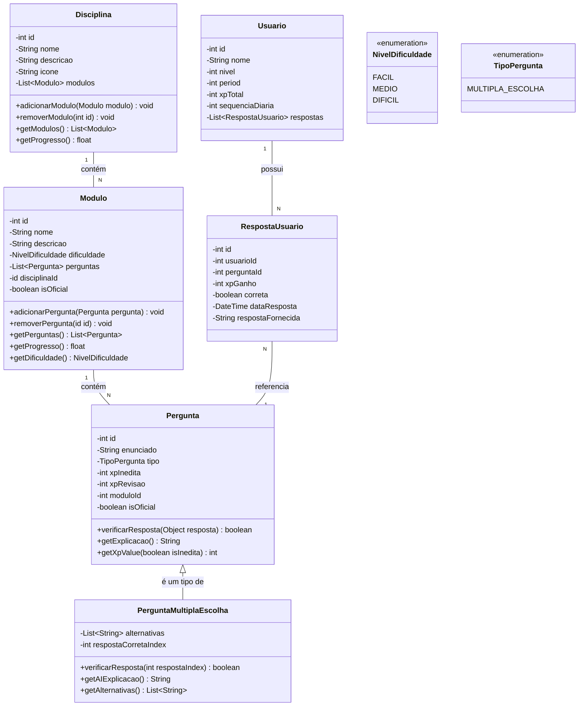

# Diagrama de Classes - BCC Review

Este documento descreve as principais classes do sistema BCC Review conforme especificação do projeto.

## Diagrama de Classes

```mermaid
classDiagram
    class Usuario {
        -int id
        -String nome
        -int nivel
        -int period
        -int xpTotal
        -int sequenciaDiaria
        -List~RespostaUsuario~ respostas
    }

    class RespostaUsuario {
        -int id
        -int usuarioId
        -int perguntaId
        -int xpGanho
        -boolean correta
        -DateTime dataResposta
        -String respostaFornecida
    }

    class Disciplina {
        -int id
        -String nome
        -String descricao
        -String icone
        -List~Modulo~ modulos
        +adicionarModulo(Modulo modulo) void
        +removerModulo(int id) void
        +getModulos() List~Modulo~
        +getProgresso() float
    }
    
    class Modulo {
        -int id
        -String nome
        -String descricao
        -NivelDificuldade dificuldade
        -List~Pergunta~ perguntas
        -id disciplinaId
        -boolean isOficial
        +adicionarPergunta(Pergunta pergunta) void
        +removerPergunta(id id) void
        +getPerguntas() List~Pergunta~
        +getProgresso() float
        +getDificuldade() NivelDificuldade
    }

    class NivelDificuldade {
        <<enumeration>>
        FACIL
        MEDIO
        DIFICIL
    }
    
    class Pergunta {
        -int id
        -String enunciado
        -TipoPergunta tipo
        -int xpInedita
        -int xpRevisao
        -int moduloId
        -boolean isOficial
        +verificarResposta(Object resposta) boolean
        +getExplicacao() String
        +getXpValue(boolean isInedita) int
    }
    
    class TipoPergunta {
        <<enumeration>>
        MULTIPLA_ESCOLHA
    }
    
    class PerguntaMultiplaEscolha {
        -List~String~ alternativas
        -int respostaCorretaIndex
        +verificarResposta(int respostaIndex) boolean
        +getAIExplicacao() String
        +getAlternativas() List~String~
    }
    
    Disciplina "1" -- "N" Modulo : contém
    Modulo "1" -- "N" Pergunta : contém
    Pergunta <|-- PerguntaMultiplaEscolha : é um tipo de
    Usuario "1" -- "N" RespostaUsuario : possui
    RespostaUsuario "N" -- "1" Pergunta : referencia
```